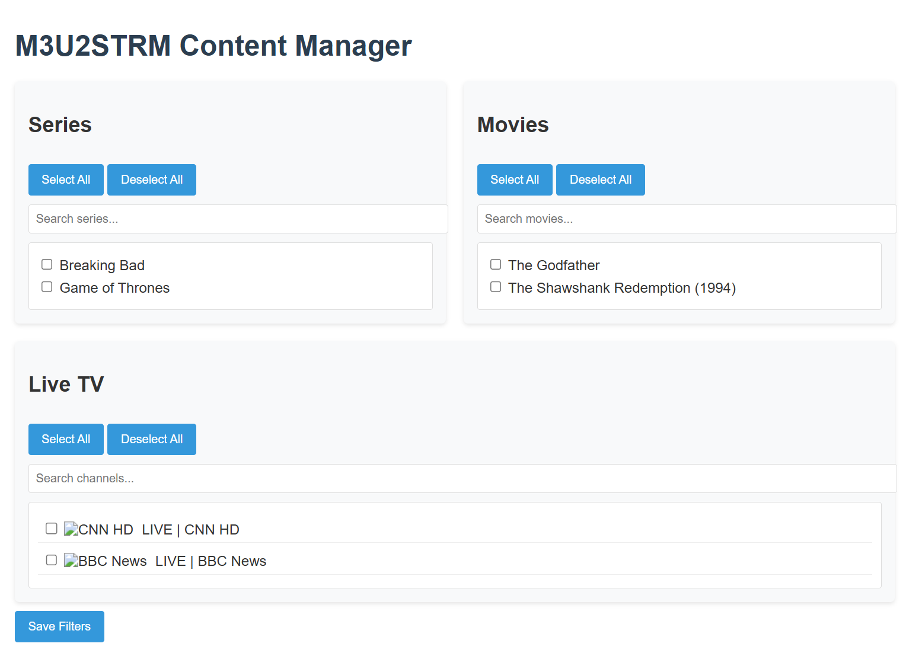

# M3U2STRM

A Python utility that converts M3U playlists into STRM files for use with media servers like Jellyfin, Plex, or Kodi.

## What It Does

M3U2STRM takes your M3U playlist and:
1. Categorizes content into series, movies, and live TV
2. Creates STRM files that point to media streams
3. Organizes content in a folder structure compatible with media servers
4. Updates only when content changes
5. Sends notifications when new content is available

## Features

- ✅ Converts M3U streams to organized STRM files
- 📁 Auto-detects content type from URL patterns (series, movies, live)
- 📺 Creates proper TV series structure with seasons and episodes
- 🎬 Organizes movies with year information when available
- 📡 Generates a clean live.m3u file for direct use
- 🔥 Shows recently added content (highest URL IDs)
- 🔄 Checks for content changes and updates efficiently
- 📱 Sends Telegram notifications for new content
- 🌐 Dark-themed Web UI for browsing and selecting content
- 🐳 Docker support for easy deployment
- 🔄 Optional Jellyfin library refresh integration

## Quick Start

### Using Docker (Recommended)

```bash
# 1. Clone the repository
git clone https://github.com/yourusername/m3u2strm.git
cd m3u2strm

# 2. Edit docker-compose.yml with your settings

# 3. Run with Docker Compose
docker-compose up -d
```

### Manual Installation

```bash
# 1. Clone the repository
git clone https://github.com/yourusername/m3u2strm.git
cd m3u2strm

# 2. Install requirements
pip install -r requirements.txt

# 3. Run the application
python task.py
```

## Configuration

### Essential Settings

| Variable | Description | Example |
|----------|-------------|---------|
| `M3U_URL` | URL to download M3U playlist | `http://provider.com/playlist.m3u` |
| `M3U_FILE` | Path to local M3U file (alternative to URL) | `/path/to/playlist.m3u` |

### Content Groups
Content type is now automatically detected from URL patterns:
- **Series**: URLs containing `/series/` with `.mkv` extension
- **Movies**: URLs containing `/movie/` with `.mkv` extension
- **Live TV**: Requires group filter (no URL pattern available)

| Variable | Description | Example |
|----------|-------------|---------|
| `LIVE_GROUPS` | Groups containing live TV (required for Live TV filtering) | `LIVE,TV,CHANNELS,ULUSAL` |

### Additional Settings

| Variable | Description | Default |
|----------|-------------|---------|
| `TASK_INTERVAL` | Minutes between updates | `5` |
| `WEB_UI_PORT` | Port for the web interface | `8475` |
| `DEBUG_LOGGING` | Enable verbose logging | `false` |
| `NEW_CONTENT_NOTIFICATION` | Enable new content discovery notifications (sends highest ID items) | `false` |

### Notifications & Integration

| Variable | Description | Example |
|----------|-------------|---------|
| `TELEGRAM_BOT_TOKEN` | Telegram bot API token | `123456789:ABCdefGhIjKlmnOpQrsTUVwxyz` |
| `TELEGRAM_CHAT_ID` | Telegram chat to receive notifications | `12345678` |
| `JELLYFIN_URL` | Jellyfin server URL | `http://192.168.1.100:8096` |
| `JELLYFIN_API_KEY` | Jellyfin API key | `32character_api_key_from_jellyfin` |

## Web UI

Access the web UI at `http://your-server-ip:8475` to:
- Browse all content from your M3U playlist
- Select specific series, movies, and channels to include
- Search for specific titles
- Save your selections for STRM generation



## How Content is Organized

```
vods/
├── series/
│   └── Show Name/
│       └── Season 01/
│           └── Show Name S01E01.strm
├── movies/
│   └── Movie Name (2023)/
│       └── Movie Name (2023).strm
└── live.m3u
```

## Content Detection Logic

Content type is now automatically detected from URL patterns:
- **Series**: URLs containing `/series/` with `.mkv` extension
- **Movies**: URLs containing `/movie/` with `.mkv` extension
- **Live TV**: All other URLs (requires `LIVE_GROUPS` filter)

Episode detection patterns:
- "S01 E01" format
- "1x01" format

## M3U Format Example

```
#EXTM3U
#EXTINF:-1 tvg-id="series1" tvg-name="Breaking Bad S01 E01" group-title="SERIES",Breaking Bad S01 E01
http://example.com/series/user/pass/12345.mkv

#EXTINF:-1 tvg-id="movie1" tvg-name="Inception (2010)" group-title="MOVIES",Inception (2010)
http://example.com/movie/user/pass/67890.mkv

#EXTINF:-1 tvg-id="live1" tvg-name="CNN" group-title="LIVE",CNN HD
http://example.com/user/pass/11111
```

**Note**: Series and Movies are detected from `/series/` and `/movie/` URL paths. Live TV uses group-title filter.

## Common Use Cases

1. **Adding IPTV to Jellyfin/Plex/Kodi**: Convert streams to structured libraries
2. **Organizing VOD Content**: Sort series and movies automatically
3. **Managing Live TV**: Create a single file for all channels
4. **Content Selection**: Use the web UI to pick which content to include

## Troubleshooting

- **No content appearing?** Check your filters in the web UI - you must select specific series, movies, or channels
- **Live TV not detected?** Verify `LIVE_GROUPS` environment variable matches your M3U group titles
- **Series not detected?** Ensure titles follow "S01 E01" or "1x01" naming patterns
- **Docker issues?** Verify volume mappings and environment variables

For more detailed examples and a sample M3U file, see `example.m3u` included in the repository.

## License

This project is licensed under the MIT License - see the LICENSE file for details.